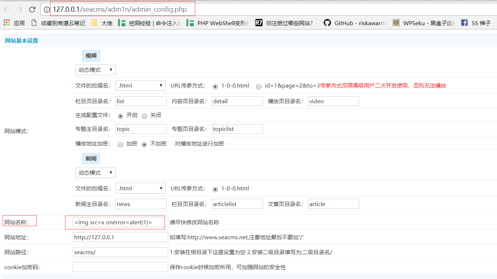
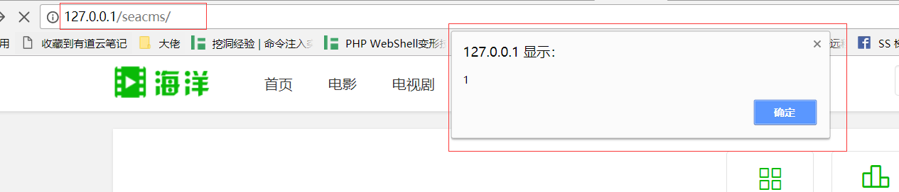

### seacms V6.61 has xss vulnerability in site name parameter of admin_config.php 

In login with admin and visit http://127.0.0.1/seacms/adm1n/admin_config.php to set the web site name as 
```


```
Then save it.



There is a alert box when browse the site again.In other words,there is xss vulnerability.



